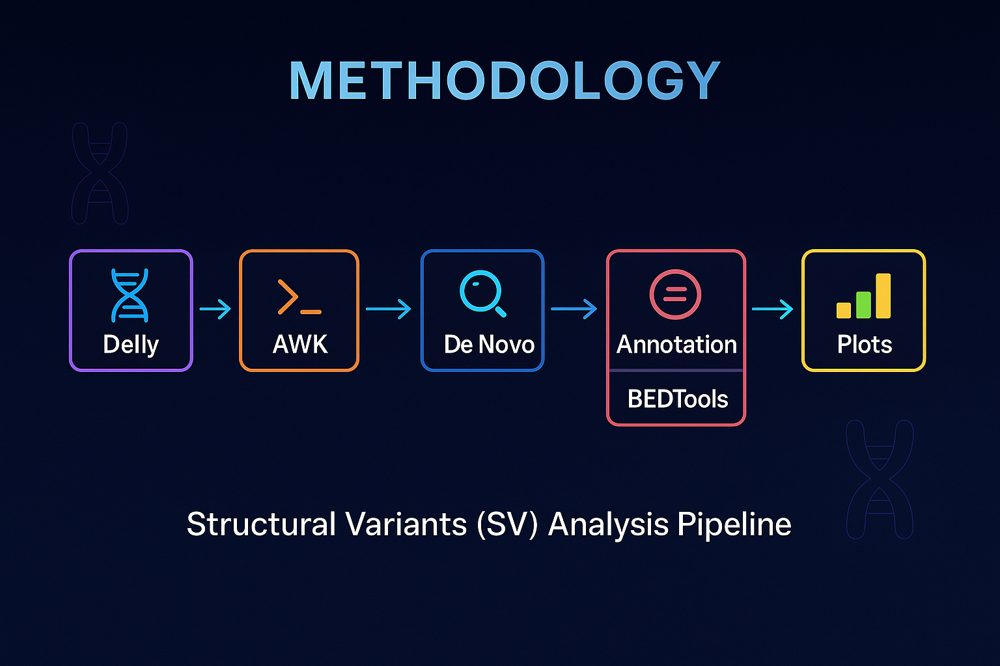

# Structural Variant (SV) Analysis Pipeline  
### *MSc Bioinformatics Project*

This repository contains a complete, end‑to‑end structural variant (SV) analysis pipeline developed as part of an MSc Bioinformatics project. This can analyse a Delly VCF file of any family of trio (father, mother, child) for their structural variants. It can be applied to other Delly VCF files by tweaking the file and folder names a bit and changing the code. 
The pipeline processes a **Delly-generated VCF**, performs **sample detection (child and parents)**, **parent detection (who father and who mother)**, **sex determination of the child**,  **SV extraction**, **de novo detection**, **family‑based inference**, **BED-based annotation**, and **high‑quality visualisation**.

It combines shell scripting, AWK and Python scripts, ANNOVAR and ClinVar databases, and BEDTools-based comparisons.

---

<p align="center">
  
</p>

---

# 🔬 Project Overview

This project demonstrates how to:

- Parse and process **structural variants** from a raw **Delly VCF** file 
- Extract PASS‑filtered variants (quality check) and compute SV statistics
- Apply PRECISE-formatted reads to check the reads supported by both paired-end and split reads
- Identify the **child sample** in a trio using Mendelian violation logic
- Identifying the parents (using X chromosome heterozygosity) and the sex of the child
- Detect **de novo structural variants**
- Infer **parents** and **child sex** using chrX heterozygosity
- Convert ANNOVAR and ClinVar reference files into BED files for annotation
- Annotate SVs using **gene**, **exon**, and **ClinVar SV** datasets
- Generate **plots** and **summary reports**

---

# 📁 Repository Structure

```
├──DellyVariation.vcf              # Input VCF (example)
│
├──pipeline.py                     # Main script (orchestrates full workflow)
├── script.sh                      # AWK-based DELLY VCF parser (SV extraction)
├── annotate_sv.py                 # Annotation using BEDTools & Python
├── sv_plot.py                     # Generates plot from output csv and txt files
├── bed.sh                         # Used to convert ANNOVAR refGene + ClinVar SV txt to BED
│
├── annovar/humandb/               # ANNOVAR and ClinVar reference files (.txt)
│       └── hg38_refGene.txt       # ANNOVAR Human Reference Genes (Annotated)
│       └── clinvar_SV.txt         # ClinVar Annotated Structural Variants with pathogenic link     
│
├── output/                                           # Final results (can be cleared for reruns)
│      └── summary_stats.txt                          # Overall summary statistics
│      └── SV_summary.txt                             # Complete list of SVs found in the VCF   
│      └── denovo_variants_imprecise.txt              # de novo SVs in child sample (imprecise + precise reads)
│      └── denovo_variants_precise.txt                # de novo SVs in child sample (precise reads only)
│      └── SV_summary_annotated.csv                   # All SVs annotated using ANNOVAR gene database
│      └── SV_summary_annotated_exonic.csv            # All SVs within exons (protein-coding regions)
│      └── SV_summary_annotated_pathLink.csv          # All SVs with link to some pathogenic condition (ClinVar database as reference)
│      └── denovo_variants_imprecise_annotated.csv    # Annotated imprecise+precise de novo SVs
│      └── denovo_variants_precise_annotated.csv      # Annotated precise-only de novo SVs
│
├── plots/                                            # All visualisations generated by sv_plot.py (autogenerated)
│     ├── SV_summary_chromosome_distribution.png
│     ├── SV_summary_function_distribution.png
│     ├── SV_summary_top_genes.png
│     ├── SV_exonic_chromosome_distribution.png
│     ├── SV_exonic_alt_type_counts.png
│     ├── SV_exonic_top_genes.png
│     ├── SV_pathogenic_chromosome_distribution.png
│     ├── SV_pathogenic_function_distribution.png
│     ├── SV_pathogenic_top_genes.png
│     ├── SV_pathlink_alt_type_counts.png
│     ├── denovo_imprecise_chromosome_distribution.png
│     ├── denovo_imprecise_function_distribution.png
│     ├── denovo_imprecise_top_genes.png
│     ├── summary_snv_vs_svs.png
│     ├── summary_allele_structure.png
│     └── summary_precise_imprecise_pie.png
│
├── LICENSE
├── requirements.txt
└── README.md
```

Users may delete all contents inside **output/** and regenerate them when running the workflow.

---
# 🛠️ Software Dependencies

The following software must be installed:

| Dependency | Purpose |
|-----------|---------|
| **Python ≥ 3.8** | Runs the main script |
| **awk** | Fast VCF parsing |
| **BEDTools** | Annotation using genomic intervals |
| **git** | Version control (optional) |

### Check installations

```bash
python3 --version
awk --version
bedtools --version
```

---


# 📦 Python Dependencies

Listed in `requirements.txt`:

```
pandas
matplotlib
seaborn
os
subprocess
sys
re
```

---


# 🧬 Methodology (High‑level)

The workflow contains **four main components**:

## **1. DELLY VCF Parsing (AWK — script.sh)**  
The VCF file is processed using an AWK script:

- Filters out non‑PASS variants  
- Extracts: `CHROM`, `POS`, `END`, `SVTYPE`, `PE`, `SR`, `SV length`  
- Extracts genotypes for three samples (HG00512, HG00513, HG00514)  
- Detects the **child** using Mendelian rules  
- Detects **de novo SVs**  
- Computes:  
  - Variant counts  
  - SV type distribution  
  - Chromosome enrichment  
  - SNV vs SV ratio  
  - Bi‑allelic vs multi‑allelic  
- Infers parents using **chrX heterozygosity**  
- Infers sex of child (presence/absence of chrX heterozygosity)  
- Generates:  
```
SV_summary.txt
SV_summary.avinput
denovo_variants_precise.txt
denovo_variants_imprecise.txt
denovo_variants_precise.avinput
denovo_variants_imprecise.avinput
output/SV_summary_annotated.csv
output/denovo_variants_precise_annotated.csv
output/denovo_variants_imprecise_annotated.csv
output/SV_summary_annotated_exonic.csv
output/SV_summary_annotated_pathLink.csv
```

---

## **2. Reference BED Generation (bed.sh)**  
To enable annotation, the script converts reference datasets into BED format.

### **Datasets used**

| Source | File | Purpose |
|-------|------|---------|
| **ANNOVAR human genome database** | `annovar/humandb/hg38_refGene.txt` | Generate gene BED + exon BED |
| **NCBI ClinVar structural variant dataset** | `ClinVar_SV.txt` | Generate ClinVar SV BEDs |

Can be found inside:
```
annovar/humandb/
```

### **Generated BED files**

| BED File | Description |
|---------|-------------|
| `hg38_refGene.bed` | Gene-level regions |
| `hg38_exons.bed` | Expanded exon-level regions |
| `clinvar_SV.bed` | ClinVar SVs filtered by variant type |
| `clinvar_SV_condition.bed` | ClinVar SVs annotated with condition + germline class |

These are later used with BEDTools to annotate DELLY variants.

---

## **3. Annotation (Python — annotate_sv.py)**  
The annotation script performs:

- **BEDTools intersect** between temporary BED files from AVINPUT files of the SVs (annotate_sv.py) and reference BED files
- Mapping SVs to:
  - Gene names  
  - Exon locations  
  - Known pathogenic ClinVar regions  
- Generation of annotation tables (`*_annotated.csv`)

---

## **4. Visualisation (Python — sv_plot.py)**  
The script generates high‑quality figures summarizing:

- SV types  
- Chromosomal SV loads  
- Exonic SV distributions  
- ClinVar-linked pathogenic SVs  
- De novo SV patterns  
- Functional classification  
- SNVs vs SVs  
- Allele structure  
  

All plots are saved in:

```
plots/
```

---

---

# 📌 Input Files Used in This Project

### **1. DellyVariation.vcf**
A DELLY‑generated trio VCF used for demonstrating the entire workflow.

### **2. ANNOVAR Reference Database Files**
Downloaded from:  
https://annovar.openbioinformatics.org/en/latest/

Specifically used:  
- `hg38_refGene.txt`

### **3. ClinVar Structural Variant Dataset**
Downloaded manually from NCBI:  
https://www.ncbi.nlm.nih.gov/clinvar/?term=%22structural+variant%22

Saved as:  
```
annovar/humandb/ClinVar_SV.txt
```

---

# 🚀 Running the Full Pipeline

## **1. Install Dependencies**
```
pip install -r requirements.txt
```


## **2. Make Scripts Executable**
```
chmod 777 script.sh
chmod 777 bed.sh

```

---

## **3. Generate BED Reference Files**
```
./bed.sh
```

---

## **4. Run the Main Pipeline**
The entire workflow is controlled through:

```
python pipeline.py

```
OR

```
python3 pipeline.py

```

This will:

- Parse VCF  
- Generate summary + .avinput files  
- Annotate variants  
- Create visuals  
- Save results into the **output/** and **plots/** directories 

---


# 📊 Output Files Generated

The pipeline automatically produces the following files:

## 🧬 1. SV Extraction Outputs (from AWK script)
These files are generated directly from the DELLY VCF:

- `SV_summary.txt`  
  Summary of all structural variants extracted from the VCF.
  
- `SV_summary.avinput`  
  ANNOVER-compatible input file for downstream annotation.

- `denovo_variants_precise.txt`  
  De novo SVs detected using precise breakpoint-supporting reads.

- `denovo_variants_imprecise.txt`  
  De novo SVs including both precise and imprecise calls.

- `denovo_variants_precise.avinput`  
  `.avinput` representation of precise de novo SVs.

- `denovo_variants_imprecise.avinput`  
  `.avinput` representation of imprecise+precise de novo SVs.


## 🧬 2. Annotation Outputs (inside `output/`)
Generated after intersecting `.avinput` files with gene, exon, and ClinVar BED files:

- `output/SV_summary_annotated.csv`  
  All SVs annotated with gene, exon, and ClinVar information.

- `output/denovo_variants_precise_annotated.csv`  
  Annotated precise de novo SVs.

- `output/denovo_variants_imprecise_annotated.csv`  
  Annotated imprecise+precise de novo SVs.

- `output/SV_summary_annotated_exonic.csv`  
  SVs located in **protein-coding exons**.

- `output/SV_summary_annotated_pathLink.csv`  
  SVs linked to **pathogenic/clinical relevance** (from ClinVar).


Users may delete all contents inside this folder and regenerate them.

---

# 🧠 Skills Demonstrated

- Next‑generation sequencing (NGS) analysis  
- Structural variant interpretation  
- AWK scripting  
- Python workflow automation  
- BEDTools‑based annotation  
- Data cleaning of genomic reference databases  
- Trio‑aware variant analysis  
- Visualisation and report generation  

---

# 📜 License

This repository is released under the **MIT License** (see LICENSE).

---

# 👤 Contact  
**Shalini Majumder**;
*sxm2220@student.bham.ac.uk / shalinimajumder24@gmail.com*;
*MSc Bioinformatics, University of Birmingham*

